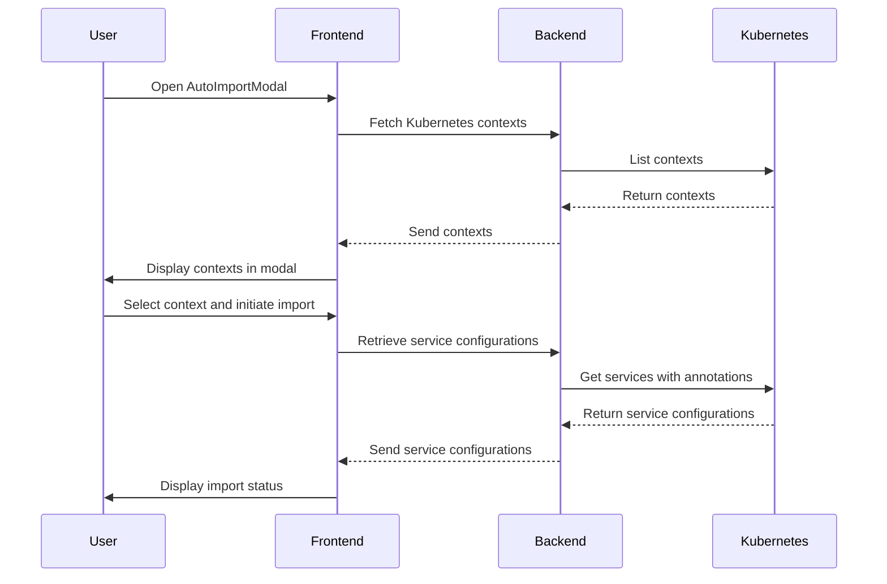

This Release adds an auto-import feature to KFTray and KFTUI. import Kubernetes service configurations by selecting a context in the new "Auto Import". Services with the annotation kftray.app/enabled: true will be imported, and additional configurations can be specified using the kftray.app/configs annotation in the format alias-localPort-targetPort. This feature automates the configuration import process.

This PR adds an auto-import feature to KFTray and KFTUI. import Kubernetes service configurations by selecting a context in the new "Auto Import". Services with the annotation `kftray.app/enabled: true` will be imported, and additional configurations can be specified using the `kftray.app/configs` annotation in the format `alias-localPort-targetPort`. This feature automates the configuration import process.
<!-- This is an auto-generated comment: summarize by coderabbit.ai -->
<!-- walkthrough_start -->

## Walkthrough

The changes introduced in this pull request significantly enhance the functionality of the `kftray-portforward` project. New asynchronous functions have been added to facilitate the interaction with Kubernetes resources, including the ability to list Kubernetes contexts, retrieve all namespaces, and get services with specific annotations. The core module has been expanded to include functionality for retrieving service configurations based on selected contexts, with added helper functions for parsing and creating configurations.

In the user interface, a new modal component, `AutoImportModal`, has been integrated into the application, allowing users to import Kubernetes service configurations based on selected contexts. This modal is accessible from both the footer and the main component of the application, enhancing user interaction. The application state management has been updated to accommodate context selection, and the UI has been modified to reflect these changes, including the addition of a context selection popup.

Overall, the modifications introduce new features for managing Kubernetes resources, improve user experience through enhanced UI components, and streamline the application's functionality related to service configurations and context management.

## Changes

| Files                                         | Change Summary                                                                                                                                                                                                 |
|-----------------------------------------------|-----------------------------------------------------------------------------------------------------------------------------------------------------------------------------------------------------------------|
| `crates/kftray-portforward/src/client.rs`    | Added functions for listing Kubernetes contexts, namespaces, and services with specific annotations.                                                                                                         |
| `crates/kftray-portforward/src/core.rs`      | Introduced a function to retrieve service configurations based on context and added helper functions for parsing configurations.                                                                               |
| `crates/kftray-tauri/src/commands/kubecontext.rs` | Added a command for retrieving services with annotations, callable from the Tauri frontend.                                                                                                                  |
| `crates/kftray-tauri/src/main.rs`            | Integrated the new command into the application's command execution process.                                                                                                                                 |
| `crates/kftui/src/.gitignore`                | Removed port forwarding functions, indicating a potential shift in functionality.                                                                                                                             |
| `crates/kftui/src/tui/input/mod.rs`          | Added state management for context selection and modified input handling to accommodate new functionality.                                                                                                   |
| `crates/kftui/src/tui/input/navigation.rs`   | Introduced functions for handling context selection and auto-adding configurations.                                                                                                                           |
| `crates/kftui/src/tui/ui/draw.rs`            | Updated UI rendering logic to include context selection and modified menu items.                                                                                                                              |
| `crates/kftui/src/tui/ui/popup.rs`           | Added a function for rendering the context selection popup in the UI.                                                                                                                                       |
| `frontend/src/components/AutoImportModal/index.tsx` | Introduced a new modal component for importing Kubernetes service configurations with state management and API integration.                                                                                     |
| `frontend/src/components/Footer/index.tsx`   | Integrated the `AutoImportModal` into the footer with state management for modal visibility.                                                                                                                  |
| `frontend/src/components/Main/index.tsx`     | Added the `AutoImportModal` to the main component with state management for visibility.                                                                                                                       |
| `frontend/src/types/index.ts`                 | Introduced a new interface for the `AutoImportModal` props, enhancing type safety.                                                                                                                           |

## Sequence Diagram(s)

<!-- walkthrough_end --><!-- This is an auto-generated comment: raw summary by coderabbit.ai -->

<!--

crates/kftray-portforward/src/client.rs: ## AI-generated summary of changes

The diff introduces several new asynchronous functions to enhance the functionality of the Kubernetes client in the `kftray-portforward` project. Notably, it adds the `list_kube_contexts` function, which retrieves and lists Kubernetes contexts from the provided kubeconfig. This function handles both the case where a kubeconfig is provided and where it is not, returning a vector of `KubeContextInfo` structures that encapsulate the context names.

Additionally, the `list_all_namespaces` function is introduced, which fetches all namespaces from the Kubernetes cluster using the provided client. It constructs a list of namespace names from the retrieved namespace objects.

Another significant addition is the `get_services_with_annotation` function, which retrieves services from a specified namespace that have a specific annotation (`kftray.app/enabled` set to "true"). This function constructs a vector of tuples containing the service name, its annotations as a hashmap, and the ports extracted from the service.

The diff also includes the `extract_ports_from_service` function, which processes a service object to extract its ports into a hashmap, and the `resolve_named_port` function, which resolves port numbers based on their names.

Overall, these changes enhance the Kubernetes client capabilities by allowing it to list contexts, namespaces, and services with specific annotations, thereby improving the interaction with Kubernetes resources.

## Alterations to the declarations of exported or public entities

- Added: `pub async fn list_kube_contexts(kubeconfig: Option<String>) -> Result<Vec<KubeContextInfo>, String>` in `crates/kftray-portforward/src/client.rs`
- Added: `pub async fn list_all_namespaces(client: Client) -> Result<Vec<String>, anyhow::Error>` in `crates/kftray-portforward/src/client.rs`
- Added: `pub async fn get_services_with_annotation(client: Client, namespace: &str, _: &str) -> Result<Vec<(String, HashMap<String, String>, HashMap<String, i32>)>, Box<dyn std::error::Error>>` in `crates/kftray-portforward/src/client.rs`

---

crates/kftray-portforward/src/core.rs: ## AI-generated summary of changes

The diff introduces significant new functionality to the `core.rs` file in the `kftray-portforward` crate. A new asynchronous function, `retrieve_service_configs`, is added, which retrieves service configurations based on a specified context. This function creates a client using `create_client_with_specific_context`, checks for its validity, and then retrieves all namespaces using `list_all_namespaces`. For each namespace, it fetches services annotated with a specific key using `get_services_with_annotation`. The retrieved services are processed to either parse existing configurations or create default configurations if no annotations are found.

Two additional helper functions, `parse_configs` and `create_default_configs`, are introduced. The `parse_configs` function takes a configuration string and extracts relevant details, such as alias, local port, and remote port, constructing `Config` objects accordingly. It handles parsing errors gracefully, returning `None` for invalid entries. The `create_default_configs` function generates default configurations for each port in the provided `HashMap`, ensuring that all ports are accounted for in the service configuration.

Overall, the changes enhance the functionality of the module by enabling the retrieval and parsing of service configurations, which is crucial for the application's operation in a Kubernetes environment.

## Alterations to the declarations of exported or public entities

- Added: `pub async fn retrieve_service_configs(context: &str) -> Result<Vec<Config>, String>` in `crates/kftray-portforward/src/core.rs`
- Added: `fn parse_configs(configs_str: &str, context: &str, namespace: &str, service_name: &str, ports: &HashMap<String, i32>) -> Vec<Config>` in `crates/kftray-portforward/src/core.rs`
- Added: `fn create_default_configs(context: &str, namespace: &str, service_name: &str, ports: &HashMap<String, i32>) -> Vec<Config>` in `crates/kftray-portforward/src/core.rs`

---

crates/kftray-tauri/src/commands/kubecontext.rs: ## AI-generated summary of changes

The diff introduces a new asynchronous function, `get_services_with_annotations`, to the `kubecontext.rs` file. This function is marked with the `#[tauri::command]` attribute, indicating that it is intended to be called from the Tauri frontend. The function takes a single parameter, `context_name`, which is a string reference, and returns a `Result` containing either a vector of `Config` objects or a string error message. Within the function, a logging statement is added to record the context name being processed. The core functionality of the function involves calling `retrieve_service_configs`, which is an asynchronous function that retrieves service configurations based on the provided context name. This addition enhances the module's capability to interact with Kubernetes services by allowing the retrieval of services along with their annotations.

## Alterations to the declarations of exported or public entities

- Added: `pub async fn get_services_with_annotations(context_name: &str) -> Result<Vec<Config>, String>` in `kubecontext.rs`

---

crates/kftray-tauri/src/main.rs: ## AI-generated summary of changes

The diff introduces a new command, `get_services_with_annotations`, to the existing list of commands in the `main` function of the `kftray-tauri` application. This addition enhances the functionality by allowing the application to retrieve services that have specific annotations, which may be useful for users needing to filter or manage Kubernetes services based on their annotations. The control flow is modified to include this new command, indicating that it will now be part of the command execution process within the application. Overall, this change expands the capabilities of the application without altering existing command functionalities.

## Alterations to the declarations of exported or public entities

- Added: `commands::kubecontext::get_services_with_annotations` in `src/main.rs`

---

crates/kftui/src/.gitignore: ## AI-generated summary of changes

The provided diff indicates a significant reduction in the functionality of the `start_port_forwarding` and `stop_port_forwarding` asynchronous functions within the `crates/kftui/src/.gitignore` file. Both functions have been completely removed, along with their associated logic for handling different workload types and protocols. The original implementation included detailed error handling and state management for both TCP and UDP port forwarding, as well as stopping the port forwarding process based on the workload type. The removal of these functions suggests a shift in the design or functionality of the application, potentially indicating a move towards a different method of handling port forwarding or a complete removal of this feature from the codebase. The absence of these functions may impact any components that relied on them for port forwarding operations, leading to potential breaks in functionality or the need for alternative implementations.

## Alterations to the declarations of exported or public entities

- Removed: `pub async fn start_port_forwarding(app: &mut App, config: Config)` in `crates/kftui/src/.gitignore`
- Removed: `pub async fn stop_port_forwarding(app: &mut App, config: Config)` in `crates/kftui/src/.gitignore`

---

crates/kftui/src/tui/input/mod.rs: ## AI-generated summary of changes

The diff introduces several significant modifications to the functionality of the application, particularly in the context of managing application states and user input handling. A new state, `ShowContextSelection`, is added to the `AppState` enum, which allows the application to enter a mode for selecting contexts. Correspondingly, the `App` struct is updated to include new fields: `contexts`, `selected_context_index`, and `context_list_state`, which facilitate the management of context selections.

The `handle_input` function is modified to include a case for the new `ShowContextSelection` state, where it logs the state and calls a new function, `handle_context_selection_input`, to process user input specific to context selection. This function handles key events for entering a context, as well as navigating through the list of contexts using the up and down arrow keys. The logic ensures that the selected context can be confirmed with the Enter key, and it updates the `selected_context_index` accordingly.

Additionally, the `handle_menu_input` function is updated to accommodate the new context selection functionality. The condition for incrementing the `selected_menu_item` is adjusted to allow for an additional menu item, reflecting the integration of the context selection feature. The action associated with the first menu item is also changed to invoke `handle_auto_add_configs`, indicating a shift in the functionality of that menu option.

Overall, these changes enhance the application's capability to manage and navigate through different contexts, improving user interaction and control flow.

## Alterations to the declarations of exported or public entities

- Added: `pub contexts: Vec<String>` in struct `App` in `crates/kftui/src/tui/input/mod.rs`
- Added: `pub selected_context_index: usize` in struct `App` in `crates/kftui/src/tui/input/mod.rs`
- Added: `pub context_list_state: ListState` in struct `App` in `crates/kftui/src/tui/input/mod.rs`
- Added: `pub async fn handle_context_selection_input(app: &mut App, key: KeyCode) -> io::Result<()>` in `crates/kftui/src/tui/input/mod.rs`
- Added: `AppState::ShowContextSelection` in enum `AppState` in `crates/kftui/src/tui/input/mod.rs`

---

crates/kftui/src/tui/input/navigation.rs: ## AI-generated summary of changes

The diff introduces significant enhancements to the functionality of the navigation module in the `kftui` crate. It adds two new asynchronous functions: `handle_auto_add_configs` and `handle_context_selection`, which expand the application's capability to manage Kubernetes contexts and service configurations.

The `handle_auto_add_configs` function retrieves a list of Kubernetes contexts asynchronously. It handles potential errors by updating the application's error message and state if the context listing fails. Upon successful retrieval, it updates the application state to show context selection and initializes the context list for user interaction.

The `handle_context_selection` function is designed to process the user's selection of a Kubernetes context. It retrieves service configurations associated with the selected context and similarly manages errors by updating the application's error message and state if the retrieval fails. If successful, it attempts to insert each configuration into the application, handling any insertion errors in the same manner. Upon successful insertion of all configurations, the application state is set to normal.

Additionally, the diff modifies the import statements to include `AppState` from the `input` module, indicating a broader use of application states in the new functions. The overall control flow is enhanced to provide better error handling and user feedback, improving the user experience when interacting with Kubernetes contexts and configurations.

## Alterations to the declarations of exported or public entities

- Added: `pub async fn handle_auto_add_configs(app: &mut App)` in `crates/kftui/src/tui/input/navigation.rs`
- Added: `pub async fn handle_context_selection(app: &mut App, context: &str)` in `crates/kftui/src/tui/input/navigation.rs`

---

crates/kftui/src/tui/ui/draw.rs: ## AI-generated summary of changes

The diff introduces a new functionality to the user interface by adding a case for `AppState::ShowContextSelection` within the `draw_ui` function. This addition allows the application to render a context selection popup when the application state is set to `ShowContextSelection`. The implementation involves calculating the area for the popup using `centered_rect`, rendering a background overlay, and then invoking the `render_context_selection_popup` function to display the popup.

Additionally, the `menu_titles` array in the `draw_header` function has been modified to include "Auto Import" as a new menu item, replacing the previous "Import" entry. This change alters the user interface by providing a clearer distinction between the auto-import functionality and the standard import option.

Overall, these changes enhance the application's user interface by adding new interactive elements and improving menu clarity.

## Alterations to the declarations of exported or public entities

- Added: `render_context_selection_popup` in `src/tui/ui/draw.rs`
- Modified: `pub fn draw_ui(f: &mut Frame, app: &mut App, config_states: &[ConfigState])` in `src/tui/ui/draw.rs` (added handling for `AppState::ShowContextSelection`)
- Modified: `pub fn draw_header(f: &mut Frame, app: &App, area: Rect)` in `src/tui/ui/draw.rs` (changed `let menu_titles = ["Help", "Import", "Export", "About", "Quit"];` to `let menu_titles = ["Help", "Auto Import", "Import", "Export", "About", "Quit"];`)

---

crates/kftui/src/tui/ui/popup.rs: ## AI-generated summary of changes

The diff introduces a new public function `render_context_selection_popup` in the `popup.rs` file, which is responsible for rendering a context selection popup within a user interface. This function takes a mutable reference to a `Frame`, a mutable reference to an `App`, and a `Rect` area as parameters. It constructs a list of contexts from the `app` instance, creating `ListItem` objects for each context. The contexts are displayed in a `List` widget, which is styled with borders and a title. The function also includes an explanation section that provides users with instructions on selecting a context and the implications of the selection regarding service imports. The rendering logic utilizes the `Frame` to display both the context list and the explanation paragraph, ensuring that the UI is updated accordingly.

Additionally, the diff includes new imports for `List` and `ListItem` from the `ratatui::widgets` module, as well as the `App` type from the `crate::tui::input` module, indicating that the functionality now relies on these components for rendering the popup.

Overall, the changes enhance the user interface by adding a new interactive element that allows users to select contexts, thereby improving the application's usability.

## Alterations to the declarations of exported or public entities

- Added: `pub fn render_context_selection_popup(f: &mut Frame, app: &mut App, area: Rect)` in `crates/kftui/src/tui/ui/popup.rs`

---

frontend/src/components/AutoImportModal/index.tsx: ## AI-generated summary of changes

The newly introduced `AutoImportModal` component in `frontend/src/components/AutoImportModal/index.tsx` provides a user interface for importing Kubernetes service configurations based on selected contexts. The component utilizes React hooks for state management, including loading states and selected context tracking. Upon opening the modal, it fetches available Kubernetes contexts asynchronously using the `invoke` function from the Tauri API, which allows for seamless integration with backend services.

The modal features a dropdown (using `ReactSelect`) for users to select a context, displaying a loading spinner while fetching data. If a context is selected and the user initiates the import process, the component invokes another API call to retrieve service configurations associated with the selected context. The configurations are then processed in a loop, where each configuration is inserted into the system via another API call.

The user is provided with feedback through toast notifications for success or error states during the import process. The modal also includes descriptive text to guide users on the import functionality and the expected format of service annotations. The layout is structured using Chakra UI components, ensuring a responsive and visually appealing interface.

Overall, this component enhances the application's functionality by allowing users to automate the import of service configurations, improving user experience and operational efficiency.

## Alterations to the declarations of exported or public entities

- Added: `const AutoImportModal: React.FC<AutoImportModalProps>` in `frontend/src/components/AutoImportModal/index.tsx`
- Exported: `export default AutoImportModal` in `frontend/src/components/AutoImportModal/index.tsx`

---

frontend/src/components/Footer/index.tsx: ## AI-generated summary of changes

The changes introduce a new modal component, `AutoImportModal`, to the `Footer` component in the React application. A state variable, `isAutoImportModalOpen`, is added to manage the visibility of this modal. Two new functions, `openAutoImportModal` and `closeAutoImportModal`, are defined to handle the opening and closing of the modal, respectively. The modal is integrated into the footer's JSX structure, allowing it to be displayed conditionally based on the state variable. Additionally, a new menu item labeled "Auto Import" is added to the footer's menu, which triggers the `openAutoImportModal` function when clicked. This enhances the footer's functionality by providing users with an option to open the auto-import feature directly from the footer interface.

## Alterations to the declarations of exported or public entities

- Added: `const openAutoImportModal = () => { ... }` in `Footer` component in `frontend/src/components/Footer/index.tsx`
- Added: `const closeAutoImportModal = () => { ... }` in `Footer` component in `frontend/src/components/Footer/index.tsx`
- Added: `const [isAutoImportModalOpen, setIsAutoImportModalOpen] = useState(false)` in `Footer` component in `frontend/src/components/Footer/index.tsx`
- Added: `<AutoImportModal isOpen={isAutoImportModalOpen} onClose={closeAutoImportModal} />` in `Footer` component in `frontend/src/components/Footer/index.tsx`

---

frontend/src/components/Main/index.tsx: ## AI-generated summary of changes

The diff introduces a new modal component, `AutoImportModal`, into the `KFTray` component of the application. This change involves the addition of a state variable, `isAutoImportModalOpen`, which manages the visibility of the `AutoImportModal`. The state is initialized to `false` and is updated through a function that sets it to `true` or `false` based on user interactions. The `AutoImportModal` is rendered conditionally within the component's JSX, allowing it to open and close based on the state. This addition enhances the user interface by providing a new feature for auto-importing configurations, thereby improving the overall functionality of the application.

The diff also includes minor formatting adjustments in the CSS styles, but these do not affect the logic or functionality of the code. Overall, the primary change is the integration of the `AutoImportModal`, which alters the control flow by introducing new state management and rendering logic.

## Alterations to the declarations of exported or public entities

- Added: `const [isAutoImportModalOpen, setIsAutoImportModalOpen] = useState(false)` in component `KFTray` in `frontend/src/components/Main/index.tsx`
- Added: `<AutoImportModal isOpen={isAutoImportModalOpen} onClose={() => setIsAutoImportModalOpen(false)} />` in component `KFTray` in `frontend/src/components/Main/index.tsx`

---

frontend/src/types/index.ts: ## AI-generated summary of changes

The diff introduces a new interface, `AutoImportModalProps`, to the `frontend/src/types/index.ts` file. This interface includes two properties: `isOpen`, which is a boolean indicating whether the modal is open, and `onClose`, which is a function that takes no arguments and returns void, intended to handle the closing action of the modal. The addition of this interface suggests an enhancement in the modal management functionality within the application, allowing for better type safety and clarity when dealing with modal states and actions.

## Alterations to the declarations of exported or public entities

- Added: `export interface AutoImportModalProps { isOpen: boolean; onClose: () => void; }` in `frontend/src/types/index.ts`

-->

<!-- end of auto-generated comment: raw summary by coderabbit.ai --><!-- This is an auto-generated comment: pr objectives by coderabbit.ai -->

<!--

## PR Summary

The pull request titled "add auto import based on kube annotations" introduces a feature that automates the import process by utilizing Kubernetes annotations. The implementation aims to enhance the efficiency of managing imports within the context of Kubernetes, streamlining workflows for users who interact with Kubernetes resources. The specific details of how the auto import functionality operates or its integration into the existing system are not provided in the description. However, the focus is clearly on leveraging Kubernetes annotations to facilitate this automation, potentially reducing manual effort and improving user experience in managing Kubernetes configurations.

-->

<!-- end of auto-generated comment: pr objectives by coderabbit.ai --><!-- commit_ids_reviewed_start -->

<!-- 7174de1ba24dd2d43b40009f06081bcd3eb8c646 -->

<!-- commit_ids_reviewed_end --><!-- tips_start -->

---

Thank you for using CodeRabbit. We offer it for free to the OSS community and would appreciate your support in helping us grow. If you find it useful, would you consider giving us a shout-out on your favorite social media?

Share

- [X](https://twitter.com/intent/tweet?text=I%20just%20used%20%40coderabbitai%20for%20my%20code%20review%2C%20and%20it%27s%20fantastic%21%20It%27s%20free%20for%20OSS%20and%20offers%20a%20free%20trial%20for%20the%20proprietary%20code.%20Check%20it%20out%3A&url=https%3A//coderabbit.ai)
- [Mastodon](https://mastodon.social/share?text=I%20just%20used%20%40coderabbitai%20for%20my%20code%20review%2C%20and%20it%27s%20fantastic%21%20It%27s%20free%20for%20OSS%20and%20offers%20a%20free%20trial%20for%20the%20proprietary%20code.%20Check%20it%20out%3A%20https%3A%2F%2Fcoderabbit.ai)
- [Reddit](https://www.reddit.com/submit?title=Great%20tool%20for%20code%20review%20-%20CodeRabbit&text=I%20just%20used%20CodeRabbit%20for%20my%20code%20review%2C%20and%20it%27s%20fantastic%21%20It%27s%20free%20for%20OSS%20and%20offers%20a%20free%20trial%20for%20proprietary%20code.%20Check%20it%20out%3A%20https%3A//coderabbit.ai)
- [LinkedIn](https://www.linkedin.com/sharing/share-offsite/?url=https%3A%2F%2Fcoderabbit.ai&mini=true&title=Great%20tool%20for%20code%20review%20-%20CodeRabbit&summary=I%20just%20used%20CodeRabbit%20for%20my%20code%20review%2C%20and%20it%27s%20fantastic%21%20It%27s%20free%20for%20OSS%20and%20offers%20a%20free%20trial%20for%20proprietary%20code)

Tips

### Chat

There are 3 ways to chat with [CodeRabbit](https://coderabbit.ai):

- Review comments: Directly reply to a review comment made by CodeRabbit. Example:
	- `I pushed a fix in commit <commit_id>.`
	- `Generate unit testing code for this file.`
	- `Open a follow-up GitHub issue for this discussion.`
- Files and specific lines of code (under the "Files changed" tab): Tag `@coderabbitai` in a new review comment at the desired location with your query. Examples:
	- `@coderabbitai generate unit testing code for this file.`
	-	`@coderabbitai modularize this function.`
- PR comments: Tag `@coderabbitai` in a new PR comment to ask questions about the PR branch. For the best results, please provide a very specific query, as very limited context is provided in this mode. Examples:
	- `@coderabbitai generate interesting stats about this repository and render them as a table.`
	- `@coderabbitai show all the console.log statements in this repository.`
	- `@coderabbitai read src/utils.ts and generate unit testing code.`
	- `@coderabbitai read the files in the src/scheduler package and generate a class diagram using mermaid and a README in the markdown format.`
	- `@coderabbitai help me debug CodeRabbit configuration file.`

Note: Be mindful of the bot's finite context window. It's strongly recommended to break down tasks such as reading entire modules into smaller chunks. For a focused discussion, use review comments to chat about specific files and their changes, instead of using the PR comments.

### CodeRabbit Commands (Invoked using PR comments)

- `@coderabbitai pause` to pause the reviews on a PR.
- `@coderabbitai resume` to resume the paused reviews.
- `@coderabbitai review` to trigger an incremental review. This is useful when automatic reviews are disabled for the repository.
- `@coderabbitai full review` to do a full review from scratch and review all the files again.
- `@coderabbitai summary` to regenerate the summary of the PR.
- `@coderabbitai resolve` resolve all the CodeRabbit review comments.
- `@coderabbitai configuration` to show the current CodeRabbit configuration for the repository.
- `@coderabbitai help` to get help.

### Other keywords and placeholders

- Add `@coderabbitai ignore` anywhere in the PR description to prevent this PR from being reviewed.
- Add `@coderabbitai summary` to generate the high-level summary at a specific location in the PR description.
- Add `@coderabbitai` anywhere in the PR title to generate the title automatically.

### CodeRabbit Configuration File (`.coderabbit.yaml`)

- You can programmatically configure CodeRabbit by adding a `.coderabbit.yaml` file to the root of your repository.
- Please see the [configuration documentation](https://docs.coderabbit.ai/guides/configure-coderabbit) for more information.
- If your editor has YAML language server enabled, you can add the path at the top of this file to enable auto-completion and validation: `# yaml-language-server: $schema=https://coderabbit.ai/integrations/schema.v2.json`

### Documentation and Community

- Visit our [Documentation](https://coderabbit.ai/docs) for detailed information on how to use CodeRabbit.
- Join our [Discord Community](https://discord.com/invite/GsXnASn26c) to get help, request features, and share feedback.
- Follow us on [X/Twitter](https://twitter.com/coderabbitai) for updates and announcements.

<!-- tips_end -->
