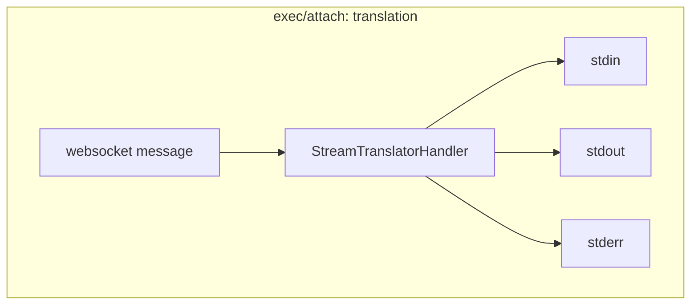
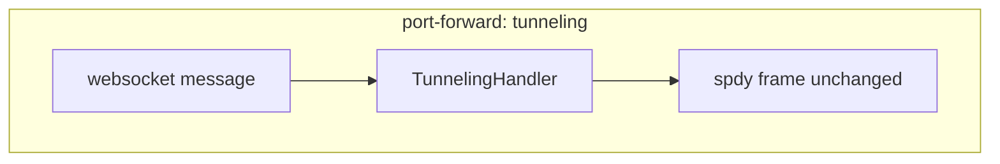
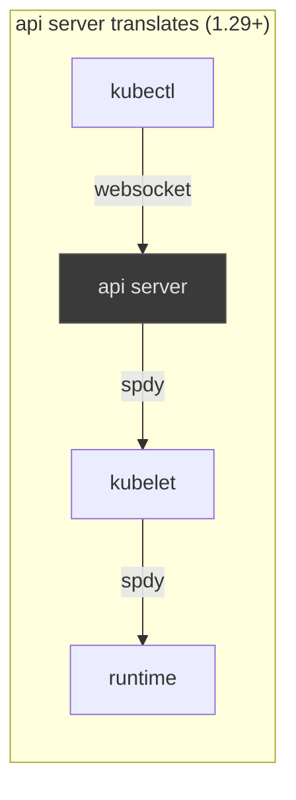
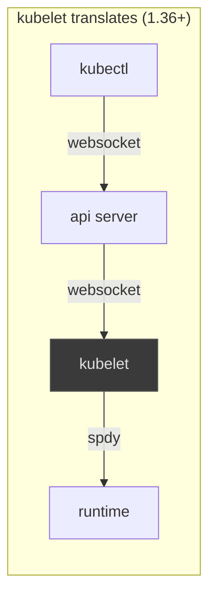
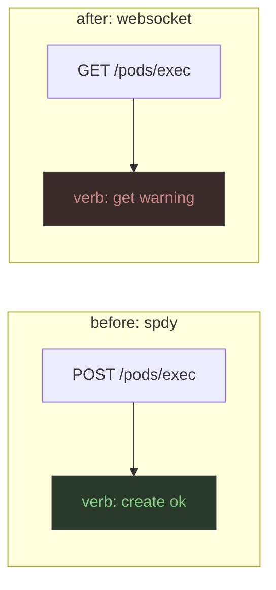

i maintain an [app](https://github.com/hcavarsan/kftray) that builds on top of kubernetes port forwarding, so i track [KEP-4006](https://github.com/kubernetes/enhancements/issues/4006) because the streaming protocol underneath keeps changing. i wrote about this back in april 2024 around Kubernetes 1.30, and six releases later it's changed enough to be worth another look, most of what follows comes from the [KEP design doc](https://github.com/kubernetes/enhancements/tree/master/keps/sig-api-machinery/4006-transition-spdy-to-websockets),  some GitHub issues, and a few wire traces against a kube cluster… the rest is just my read on it.

## Short subprotocol timeline
---
Port-forward has carried a subprotocol name since way before this migration, both ends use that name to agree on how to read the bytes after the HTTP upgrade completes

Reading the KEP, the first thing that got me was the subprotocol name, KEP names it one way (v2.portforward.k8s.io),but kube port-forward logs shows something different in the `Sec-WebSocket-Protocol` header (SPDY/3.1+portforward.k8s.io). and underneath all of that, the code still uses an older constant (portforward.k8s.io, the v1 name). None of these contradict each other once you see what each one's for… but the only way I could figure it out was to back up and walk the timeline.

The original subprotocol name is portforward.k8s.io, defined as `PortForwardProtocolV1Name` in [client-go/tools/portforward/portforward.go](https://github.com/kubernetes/client-go/blob/master/tools/portforward/portforward.go#L39-L41):

```go
const PortForwardProtocolV1Name = "portforward.k8s.io"
```

That one string described the whole port-forward wire format for the SPDY flow, the client asked for it in the upgrade headers, the server echoed it back, and from there both sides exchanged SPDY frames carrying port-forward data and error streams, pretty simple and moving to WebSockets didn't actually change what those streams carry, SPDY frames still describe the streams, kubelet routes them the same way and the container runtime terminates them like before, just the transport wrapping the frames is different now.

That's a small enough change that the team kept the v1 protocol model and just gave the new tunneling shape a second name in the KEP… `v2.portforward.k8s.io` (think of it as a label for the transport change, not a new protocol model), inside the WebSocket the bytes are the same SPDY v1 frames, and the streams inside those frames behave the same.

in `Sec-WebSocket-Protocol`, the client advertises and the server echoes `SPDY/3.1+portforward.k8s.io`. the SPDY/3.1+ is the tunneling envelope, the suffix is just the v1 name unchanged, and that prefix is the actual switch the server uses to decide between the legacy SPDY path and the new WebSocket path.

so to recap…

<Cards>
<Card title="portforward.k8s.io">
the original v1 name, still the model for what flows inside the streams.
</Card>
<Card title="v2.portforward.k8s.io">
the KEP's label for the v2 transport (SPDY frames tunneled inside WebSocket payloads) and what kubectl logs.
</Card>
<Card title="SPDY/3.1+portforward.k8s.io">
what kubectl advertises and the server echoes in `Sec-WebSocket-Protocol`, where the prefix picks the tunneling path and the suffix is the v1 name.
</Card>
</Cards>

on the client, [tunneling_dialer.go](https://github.com/kubernetes/kubernetes/blob/master/staging/src/k8s.io/client-go/tools/portforward/tunneling_dialer.go) builds the v2 request by prepending constant [SPDY/3.1+](https://github.com/kubernetes/kubernetes/blob/master/staging/src/k8s.io/apimachinery/pkg/util/portforward/constants.go#L21) to the v1 subprotocol name before sending the upgrade. 

on the server, [streamtunnel.go](https://github.com/kubernetes/kubernetes/blob/master/staging/src/k8s.io/apiserver/pkg/util/proxy/streamtunnel.go#L114-L123) only accepts the prefixed subprotocols, strips the `SPDY/3.1+`, and rebuilds an upstream SPDY request to the kubelet using the unprefixed name.

## Handshake, and the four commands
---

most kubectl commands are just plain HTTP, `kubectl get pods` is a GET that returns some JSON, and the request's over before the body finishes streaming. but four commands can't work that way… each one needs a connection that stays open and that both ends can write to as data shows up.

<Accordions>
<Accordion title="kubectl exec">
the clearest one. you type into a shell in a container, then keystrokes need to reach the container as you press them, and the output needs to flow back at the same time.
</Accordion>
<Accordion title="kubectl port-forward">
opens a tunnel for arbitrary TCP traffic. local connections on a port get forwarded into a pod, and the data flows both ways until the connection closes.
</Accordion>
<Accordion title="kubectl attach">
connects you to a process the kubelet's already running. similar to exec, but you're joining an existing process instead of starting a new one.
</Accordion>
<Accordion title="kubectl cp">
wraps exec around `tar`. it execs into the container, runs tar to pack or unpack files, and streams the archive over the same bidirectional connection.
</Accordion>
</Accordions>

The switch to Websocket uses the same `Upgrade` mechanism browsers use to open a WebSocket: client sends an HTTP request with a `Connection: Upgrade` header, server agrees with `101 Switching Protocols`, and from there the TCP connection is the new protocol.

port-forward upgrade request, SPDY vs WebSocket:

<Compare>
<CompareLeft title="SPDY upgrade">
```http
#client (kubectl)
POST /api/v1/namespaces/default/pods/my-pod/portforward HTTP/1.1
Host: kubernetes.default.svc
Connection: Upgrade
Upgrade: SPDY/3.1
X-Stream-Protocol-Version: portforward.k8s.io

#server
HTTP/1.1 101 Switching Protocols
Connection: Upgrade
Upgrade: SPDY/3.1
X-Stream-Protocol-Version: portforward.k8s.io
```
</CompareLeft>
<CompareRight title="WebSocket upgrade">
```http
#client (kubectl)
GET /api/v1/namespaces/default/pods/my-pod/portforward HTTP/1.1
Host: kubernetes.default.svc
Connection: Upgrade
Upgrade: websocket
Sec-WebSocket-Protocol: SPDY/3.1+portforward.k8s.io
Sec-WebSocket-Version: 13
Sec-WebSocket-Key: base64==

#server
HTTP/1.1 101 Switching Protocols
Connection: Upgrade
Upgrade: websocket
Sec-WebSocket-Accept: base64=
Sec-WebSocket-Protocol: SPDY/3.1+portforward.k8s.io
```
</CompareRight>
</Compare>

Two things changed between those exchanges, first the HTTP method, SPDY upgraded with a POST and WebSockets upgrade with a GET, nothing dramatic, but it has an RBAC consequence i'll get to later, second the subprotocol string, under SPDY port-forward used `portforward.k8s.io`, under WebSocket kubectl advertises `SPDY/3.1+portforward.k8s.io` and the server echoes it back

`SPDY/3.1+` is just a prefix in the kubernetes code, and the name kind of describes the framing… a WebSocket message carries an unmodified SPDY frame as its payload.

A similar subprotocol change happens for `kubectl exec`, with different strings, because exec uses a separate subprotocol family defined in [apimachinery/pkg/util/remotecommand/constants.go](https://github.com/kubernetes/kubernetes/blob/master/staging/src/k8s.io/apimachinery/pkg/util/remotecommand/constants.go#L32-L52):

<Compare>
<CompareLeft title="SPDY exec upgrade">
```http
X-Stream-Protocol-Version: v4.channel.k8s.io
```
</CompareLeft>
<CompareRight title="WebSocket exec upgrade">
```http
Sec-WebSocket-Protocol: v5.channel.k8s.io
```
</CompareRight>
</Compare>

These aren't the same kind of change though as the `exec` got a new subprotocol name and a new wire format inside the frames and `port-forward` kept the old subprotocol name, added a prefix (`SPDY/3.1+`), and kept the old wire format.

## Tunneling vs Translation
---

Port forward and `exec/attach`  went through this migration, but they ended up on opposite sides of one design choice,  Why the split? basically it comes down to how each command handle its streams.

<Compare>
<CompareLeft title="exec/attach: translation">
the WebSocket terminates at a handler that understands the inner subprotocol, demuxes the messages into per-channel streams, and rebuilds them as SPDY for the kubelet. it has a fixed set of channels, the subprotocol defines five of them: stdin, stdout, stderr, an error status channel that arrived in v4 and carries the exit code, and terminal resize events. every chunk on the wire carries a stream identifier byte, so the receiver reads each tag and forwards the bytes to whichever channel handler is waiting. a translator can sit in the middle because it knows the channels exist before any data arrives.

[`StreamTranslatorHandler`](https://github.com/kubernetes/kubernetes/blob/master/staging/src/k8s.io/apiserver/pkg/util/proxy/streamtranslator.go) runs on the API server in phase 1 and on the kubelet in phase 2. it reads the subprotocol, maps stream identifiers to I/O channels, demuxes the WebSocket message stream into per-channel SPDY connections to the backend, and forwards the bytes through:


</CompareLeft>
<CompareRight title="port-forward: tunneling">
a WebSocket carries SPDY frames byte for byte, and whatever handler unwraps them on the server never even looks at what's inside. it has no fixed set of channels, the kubelet creates a stream pair (one data, one error) for every new connection that comes through the forwarded port, then tears those streams down when the request finishes. the TCP connection stays open between requests but the streams above it come and go.

[`TunnelingHandler`](https://github.com/kubernetes/kubernetes/blob/master/staging/src/k8s.io/apiserver/pkg/util/proxy/streamtunnel.go#L114-L124) runs on the API server. it strips the `SPDY/3.1+` prefix from the negotiated subprotocol, unwraps each WebSocket message payload, and forwards the SPDY frame upstream to the kubelet without inspecting it. kubectl builds SPDY frames the way it always did, wraps each one as a WebSocket message payload, and the kubelet sees SPDY traffic on the other end:


</CompareRight>
</Compare>



```mermaid
gantt
    title port-forward: streams over time
    dateFormat x
    axisFormat %s

    section connection
    persistent connection          :active, conn, 0, 50000

    section curl 1
    data stream    :d1, 5000, 20000
    error stream   :e1, 5000, 20000

    section curl 2
    data stream    :d2, 15000, 35000
    error stream   :e2, 15000, 35000

    section curl 3
    data stream    :d3, 30000, 45000
    error stream   :e3, 30000, 45000
```

three concurrent connections through one port-forward produce six SPDY streams (three data, three error) sharing one TCP connection. streams come and go as connections open and close, but the TCP socket stays open, and that dynamism is what makes translation a bad fit for port forward, because a translator needs to know which streams exist and which channel each one maps to, with port-forward neither is known up front. tunneling sidesteps the work, the SPDY frame inside the WebSocket already carries the stream identifiers and the stream open/close signals, the server just has to unwrap the envelope.

## Why SPDY had to go
---

Basically proxies.

the proxy ecosystem moved on from SPDY faster than Kubernetes did:

<Timeline>
<TimelineItem version="2009" title="Google builds SPDY">
the original experiment, a multiplexed protocol over TCP that eventually influenced HTTP/2.
</TimelineItem>
<TimelineItem version="2015 feb" title="Google announces SPDY deprecation">
on the Chromium blog, Google said it'd drop SPDY from Chrome once [HTTP/2](https://www.rfc-editor.org/rfc/rfc7540) was deployed.
</TimelineItem>
<TimelineItem version="2015 may" title="HTTP/2 published">
the IETF published [RFC 7540](https://www.rfc-editor.org/rfc/rfc7540), built on SPDY's ideas but replacing it as a standard.
</TimelineItem>
<TimelineItem version="2015 sep" title="NGINX drops SPDY">
NGINX removed its SPDY module and replaced it with the HTTP/2 module.
</TimelineItem>
</Timeline>

Envoy never shipped SPDY support at all. by the late 2010s, the proxies and gateways sitting in front of Kubernetes clusters didn't speak SPDY natively.

so why not move kubectl onto HTTP/2 directly? three reasons in my opinion.

HTTP/2's `Upgrade` path (h2c) was kind of a thin and mostly unused thing to begin with (was deprecated)

Over TLS, HTTP/2 negotiates with ALPN rather than HTTP `Upgrade`, so the streaming stack would have to grow a second negotiation path.

and Go's `net/http` doesn't expose the HTTP/2 upgrade path in either form, Kubernetes would have to maintain its own HTTP/2 server, and the result still wouldn't survive a proxy that only knew HTTP/1.1 plus WebSocket upgrades. pretty complex.

so that left [websockets](https://www.rfc-editor.org/rfc/rfc6455) published in december 2011, before HTTP/2 and before QUIC, and it uses the same HTTP `Upgrade` handshake the rest of the streaming stack already relies on. proxies and load balancers already speak it because browsers have been using it for years, so the team picked WebSockets because deployed proxies already understand it and the migration exists to get traffic through proxies. that's basically it.

Kubernetes kept SPDY for almost a decade after Google deprecated it, the proxy ecosystem moved on within a couple years of that. a streaming protocol's just hard to migrate in a distributed system, the existing code worked, and nothing was urgent enough to make somebody do the work sooner.

## Phases
---

WebSockets aren't arriving on every leg of the streaming chain at once, kube team is rolling the migration out in two phases, each one moving the WebSocket boundary one hop deeper, and  full streaming chain runs from kubectl to the API server to the kubelet to the container runtime, every arrow is a separate TCP connection that converts on its own schedule.


<Steps>
<Step>
### API server translates (1.29+)

API server takes a WebSocket from kubectl and translates it into a SPDY connection to the kubelet. from the kubelet's point of view nothing's changed. it sees the SPDY traffic it always saw, and the container runtime sees the SPDY traffic the kubelet always sent, all the translation cost lives on the API server… which is fine for small clusters but starts to matter when a control plane handles a lot of concurrent streaming sessions


</Step>
<Step>
### Kubelet translates (1.36+)

the translation moves off the control plane and onto the nodes, now the API server passes the WebSocket through unchanged to the kubelet, and the kubelet handles the protocol translation when it talks to the container runtime


</Step>
</Steps>

Both paths coexist during rolling upgrades, so components can update in any order without breaking streaming and between the kubelet and the container runtime, SPDY stays in both phases, the KEP states the reason… the team won't transition the streaming protocol for the communication leg on the node between the kubelet and the container runtime, because that leg will keep streaming SPDY.

Makes sense imo, for traffic that never leaves the node, the proxy-compatibility argument that drove the migration doesn't apply. changing the protocol there would buy nothing and cost real work.

## RBAC fix
---

Reading just the design doc makes it pretty easy to miss an authorization edge case the migration introduced, mechanically it's simple:  SPDY's upgrade was a POST and  WebSocket's upgrade is a GET, 

RBAC maps HTTP methods to verbs that the policy engine reasons about.



<Compare>
<CompareLeft title="SPDY">
RBAC read the POST as `create`. the permission "create on `pods/exec`" is what operators recognize as "this user can exec into pods."
</CompareLeft>
<CompareRight title="WebSocket">
RBAC reads the GET as `get`. the permission "get on `pods/exec`" is weaker, some operators hand it out as a read-only role.
</CompareRight>
</Compare>

So after the method swap, a role granting `get` on `pods/exec` started allowing the operation itself. roles that were supposed to let users inspect pods started letting them exec into those pods. kind of bad :/

a new feature gate (`AuthorizePodWebsocketUpgradeCreatePermission`) adds a synthetic authorization step on top of the verb mapping. when a WebSocket upgrade hits `pods/exec`, `pods/attach`, or `pods/portforward`, the API server requires `create` on the subresource even though the underlying HTTP method's a GET, (defaults to on in 1.35)

## Fallback
---


Mixing kubectl and apiserver versions is where the migration's backstop matters. when a newer kubectl tries WebSockets against an older API server, the flow looks like:

<Steps>
<Step>
kubectl sends a WebSocket upgrade with `SPDY/3.1+portforward.k8s.io`
</Step>
<Step>
older API server doesn't recognize the subprotocol, rejects the upgrade
</Step>
<Step>
kubectl retries with a SPDY upgrade (one extra roundtrip)
</Step>
<Step>
API server accepts, streaming starts over SPDY
</Step>
</Steps>

<br /> 

<Callout type="info">
[`FallbackDialer`](https://github.com/kubernetes/kubernetes/blob/master/staging/src/k8s.io/client-go/tools/portforward/fallback_dialer.go) holds this logic. it wraps a primary tunneling dialer and a secondary SPDY dialer, with a predicate deciding whether a primary failure should trigger fallback.
</Callout>

## Releases timeline
---

mapping the KEP's implementation history onto release versions, each one added a gate, a fallback path, or both:

<Timeline>
<TimelineItem version="1.29" title="exec/attach/cp alpha">
exec/attach/cp over websockets, alpha. opt-in via `KUBECTL_REMOTE_COMMAND_WEBSOCKETS=true` and the `TranslateStreamCloseWebsocketRequests` gate.
</TimelineItem>
<TimelineItem version="1.30" title="port-forward alpha">
exec/attach/cp goes beta (on by default). port-forward arrives as alpha behind `KUBECTL_PORT_FORWARD_WEBSOCKETS=true` and the `PortForwardWebsockets` gate.
</TimelineItem>
<TimelineItem version="1.31" title="all four commands on websockets">
port-forward goes beta, on by default. all four commands now use websockets on the kubectl-to-apiserver leg.
</TimelineItem>
<TimelineItem version="1.33" title="proxy bugfix">
bugfix for websocket upgrade through https proxies ([#126134](https://github.com/kubernetes/kubernetes/issues/126134)).
</TimelineItem>
<TimelineItem version="1.35" title="RBAC fix">
rbac privilege escalation fix.
</TimelineItem>
<TimelineItem version="1.36" title="kubelet leg">
websockets extended to the kubelet, beta.
</TimelineItem>
</Timeline>


no GA milestone in that list yet, which is normal for a migration this size. every release added a new feature gate, a new fallback path, or both. each one got a release or two to bake before the team promoted the next.


## What's next (for me)
---

i'm watching my app move onto a protocol from 2011, older than HTTP/2, a lot older than QUIC. proxy support forced this migration. imho proxy support will force the next one too. here's how we got here:


<Callout type="info">
[RFC 9220](https://www.rfc-editor.org/rfc/rfc9220) defines WebSockets over HTTP/3, but it reads like a compatibility shim to me.
</Callout>


<Cards>
<Card title="2009 — SPDY">
Google built SPDY as a multiplexed protocol over TCP.
</Card>
<Card title="2015 — HTTP/2">
the IETF absorbed SPDY's ideas into [RFC 7540](https://www.rfc-editor.org/rfc/rfc7540). [RFC 9113](https://www.rfc-editor.org/rfc/rfc9113) obsoleted that in june 2022.
</Card>
<Card title="2022 — HTTP/3">
Google's follow-on, QUIC, became HTTP/3 as [RFC 9114](https://www.rfc-editor.org/rfc/rfc9114). what started with SPDY now sits on UDP and ALPN rather than TCP and HTTP `Upgrade`.
</Card>
<Card title="2026 — WebTransport (draft)">
the IETF drafted [webtransport](https://www.w3.org/TR/webtransport/) for bidirectional streaming over HTTP/3. the [drafts](https://datatracker.ietf.org/group/webtrans/documents/) are still open, but Chrome, Firefox, and Safari shipped browser support by march 2026.
</Card>
</Cards>

the interesting thing about WebTransport is that it fixes head-of-line blocking:

<Compare>
<CompareLeft title="SPDY / WebSockets (TCP)">
multiplexes over one TCP connection. a single dropped packet stalls every stream until the retransmit lands.
</CompareLeft>
<CompareRight title="WebTransport (QUIC / UDP)">
handles loss recovery per stream. drop a packet and only that stream blocks.
</CompareRight>
</Compare>

the KEP authors picked correctly i think. WebTransport specs aren't RFCs yet, and no proxy or gateway outside a browser supports it. the whole reason kube dropped SPDY was proxy compatibility, so choosing another protocol proxies can't route would repeat the problem.

SPDY, then WebSockets, then WebTransport. kube is landing on WebSockets while the IETF already drafts what replaces it. proxy pressure will probably push WebSockets out too, not in five years maybe. but whoever does that will write a different post :)

