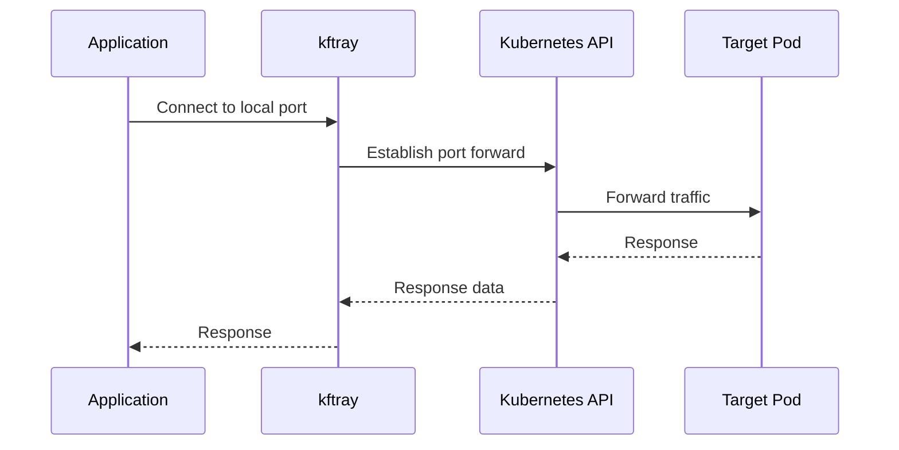
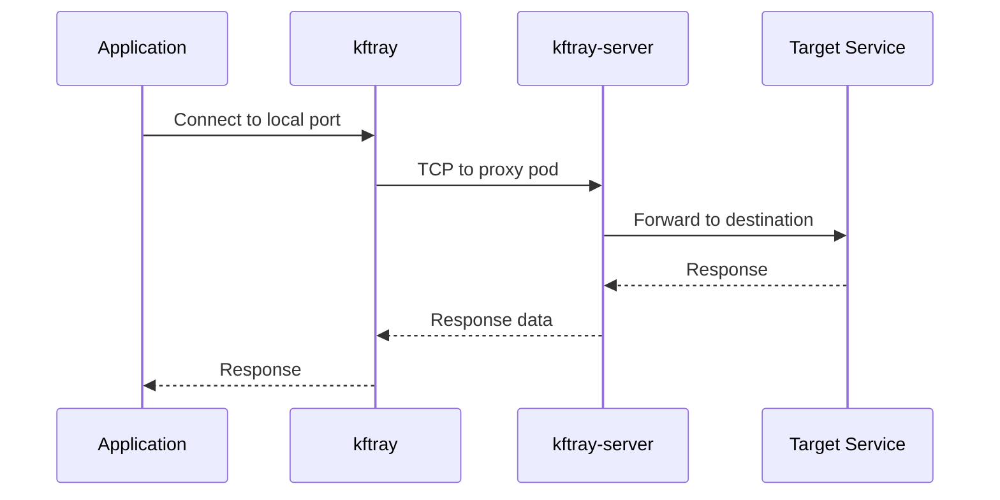
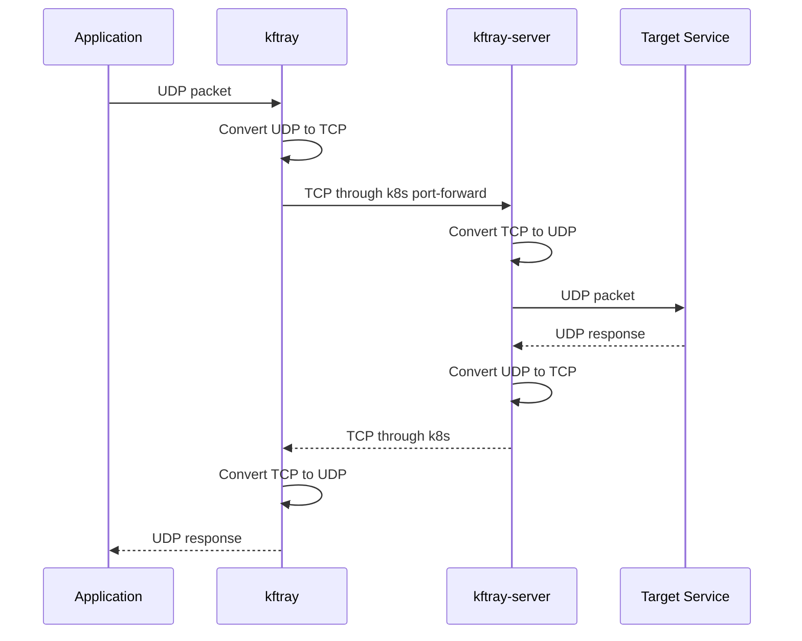

# technical architecture

`kftray` consists of multiple components that work together to provide reliable kubernetes port forwarding with features that `kubectl port-forward` can't handle. understanding this architecture helps with troubleshooting, deployment decisions, and feature usage.

## when architecture knowledge matters

architecture understanding becomes important when deploying UDP forwarding (requires cluster components), troubleshooting connectivity issues, or making decisions about security and network policies. this also helps when contributing to the project or integrating `kftray` into larger infrastructure setups.

most developers can use `kftray` effectively without deep architecture knowledge, but understanding the components helps explain why certain features work the way they do.

## core component overview

based on source code analysis, `kftray` consists of several rust crates that handle different responsibilities:

**kftray-commons**: shared configuration models, database access, and utility functions used by all other components.

**kftray-portforward**: core port forwarding logic that interfaces with the kubernetes API and manages TCP/UDP connections.

**kftray-tauri**: desktop GUI application built with tauri framework, providing the visual interface and system tray integration.

**kftui**: terminal interface application that provides keyboard-driven configuration management.

**kftray-helper**: privileged helper component for system-level operations like hostfile modification and network configuration.

**kftray-server**: proxy server component deployed in kubernetes clusters to enable UDP forwarding.

**kftray-http-logs**: HTTP traffic capture and logging functionality.

## shared configuration and state management

all components work with the same SQLite database stored in `~/.kftray/kftray.db`. this database contains configuration definitions, runtime state, and port forward history.

the shared state model means someone can create configurations in the desktop interface, start forwards in the terminal interface, and everything stays synchronized. configuration changes in one interface immediately appear in the other.

state tracking includes not just configuration data but also runtime status (which forwards are active, error states, timing information) and HTTP logs when enabled.

## tcp port forwarding architecture

### direct tcp forwarding

for TCP services, `kftray` works similarly to `kubectl port-forward` but with additional resilience and management features. the process looks like this:

the application establishes a connection to the kubernetes API using kubeconfig credentials, then creates a port forward stream to the target pod or service. local applications connect to the local port, and traffic flows directly through the kubernetes API to the target service.

the difference from kubectl lies in the management layer: `kftray` monitors connection health, handles pod restarts automatically, and provides configuration persistence across application restarts.

### tcp forwarding with proxy server

for TCP services that need to go through the proxy (when UDP forwarding is configured), traffic routes through the `kftray-server` component deployed in the cluster:

the local application connects to `kftray`, which establishes a TCP connection to the `kftray-server` pod. the proxy server then forwards traffic to the target service within the cluster.

this architecture adds a network hop but enables advanced features like UDP forwarding and traffic inspection.

## udp port forwarding architecture

UDP forwarding requires the proxy server because kubernetes doesn't support UDP port forwarding natively. the architecture becomes more complex:

the local application sends UDP packets to a local UDP socket managed by `kftray`. this socket converts UDP packets to TCP and sends them through a kubernetes port forward to the `kftray-server` pod.

the proxy server receives TCP data, converts it back to UDP, and forwards it to the target service. responses follow the reverse path: UDP from service to proxy, TCP through kubernetes to client, UDP to local application.

this conversion process introduces some latency but enables UDP services (DNS, DHCP, game servers) to work through kubernetes port forwarding.

## proxy server deployment and management

### automatic proxy deployment

when UDP forwarding is needed, `kftray` automatically deploys the `kftray-server` component to the target kubernetes cluster. this deployment uses standard kubernetes manifests and requires appropriate cluster permissions.

the proxy server runs as a pod in the target namespace and creates a service for connectivity. `kftray` manages the lifecycle of this deployment, including cleanup when no longer needed.

deployment configuration uses environment variables to specify target addresses and ports. the proxy server reads these at startup and establishes connections accordingly.

### proxy server architecture

the `kftray-server` component is a lightweight rust application that handles TCP/UDP protocol conversion and traffic relay. it supports multiple concurrent connections and maintains connection state for reliable forwarding.

error handling includes connection retry logic, graceful shutdown, and proper resource cleanup. the server reports status back to the client through standard kubernetes mechanisms.

security considerations include minimizing the attack surface (no unnecessary network services), proper input validation, and following kubernetes security best practices.

## http logging implementation

HTTP traffic logging works by intercepting traffic at the `kftray` client level. when enabled for a configuration, the client parses HTTP requests and responses passing through the port forward.

the implementation uses a streaming parser that can handle partial packets and maintains request/response correlation through trace IDs. this works at the network level, independent of the application making requests.

log files are written in real-time to `~/.kftray/http_logs/` with structured formatting that includes headers, body content, and timing information. the logging component handles binary content gracefully and provides configurable verbosity levels.

## helper component and privilege escalation

certain operations require elevated privileges: modifying system hostfiles for domain name resolution, binding to low-numbered ports, or configuring network interfaces.

the `kftray-helper` component handles these privileged operations through a secure communication protocol. the main application communicates with the helper through local sockets or pipes, passing structured requests for privileged operations.

this separation follows security best practices by minimizing the code running with elevated privileges. the helper component has a minimal attack surface and only performs specific, well-defined operations.

## configuration persistence and migration

configuration data uses a SQLite database with a versioned schema that supports migration between versions. the database includes configuration definitions, runtime state, and historical data.

migration logic handles schema updates automatically when upgrading between versions. backup and restore functionality allows moving configurations between systems or recovering from corruption.

the database design supports concurrent access from multiple interfaces (desktop and terminal) with appropriate locking to prevent corruption.

## security architecture and considerations

### credential management

kubernetes credentials come from standard kubeconfig files and follow normal kubectl authentication patterns. `kftray` doesn't store or modify credentials -- it uses the existing authentication infrastructure.

github tokens for sync functionality are stored in the system's secure credential storage (keychain on macos, credential manager on windows, keyring on linux).

### network security

traffic forwarding uses standard kubernetes API channels with the same security properties as `kubectl port-forward`. no additional network exposure occurs beyond what normal port forwarding provides.

the proxy server component runs within the kubernetes cluster and follows standard pod security policies. it doesn't expose additional attack surface to external networks.

### privilege separation

the architecture separates privileged operations (helper component) from normal operations (main application) to minimize security exposure. only specific, well-defined operations require elevated privileges.

configuration and data files use standard user permissions and don't require system-level access.

## performance characteristics and bottlenecks

### throughput and latency

TCP forwarding performance is comparable to `kubectl port-forward` since it uses similar kubernetes API mechanisms. UDP forwarding adds latency due to the conversion process and extra network hop through the proxy server.

memory usage scales with the number of active connections rather than configured forwards. inactive configurations have minimal overhead.

the HTTP logging feature can impact performance for high-throughput services due to the parsing and disk I/O overhead.

### scaling limitations

the architecture supports dozens of simultaneous port forwards efficiently. very large numbers of forwards (hundreds) may hit kubernetes API limits or system resource constraints.

proxy server performance depends on cluster resources and network capacity. each UDP forward requires a separate proxy deployment, which may impact cluster resource usage.

## deployment and operational considerations

### cluster requirements

UDP forwarding requires the ability to deploy pods in target namespaces and create services. this requires appropriate RBAC permissions and may conflict with restrictive pod security policies.

network policies may interfere with proxy server connectivity. the proxy needs to reach target services within the cluster network.

### monitoring and observability

the architecture includes logging at multiple levels: application logs, configuration database, HTTP traffic logs, and kubernetes events for proxy deployments.

error reporting flows through standard application logs and user interface notifications. diagnostic information helps troubleshoot connectivity and permission issues.

## integration patterns and extensibility

### api integration points

while `kftray` doesn't expose a formal API, the configuration database and file formats provide integration points for external tools. configuration can be managed programmatically through JSON file manipulation.

the shared database enables other tools to read port forward status and configuration, allowing integration with monitoring or automation systems.

### extension opportunities

the component architecture allows for additional interfaces beyond desktop and terminal versions. the shared configuration and port forwarding logic could support web interfaces, mobile apps, or API services.

additional protocol support could be added through new proxy server implementations or client-side protocol handlers.

this architecture provides the foundation for reliable kubernetes port forwarding while maintaining the flexibility to add features and support different usage patterns.